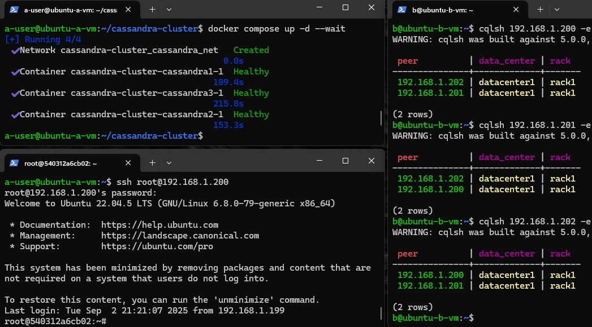

# Тестовый кластер из 3 нод Cassandra

### Создан Docker Compose скрипт для развертки кластера из трех инстансов cassandra. Каждый из них доступен из основной (локальной) сети по отдельному ip адресу + ssh с 1.197 к 1.200.

## Шаги

#### 1. На машине А (ubuntu 24.04 lts) в локальной сети с ip 192.168.1.197 запускаем скрипт docker-compose для поднятия 3 образов с ip адресами 192.168.1.200-202.

```bash
ip route | grep default # Узнаем интерфейс хоста
# Если отличен от eth0 - меняем в docker-compose.yml

# Запуск кластера в фоновом режиме с ожиданием готовности всех сервисов
docker compose up -d --wait
```

#### 2. С машины Б (ubuntu 24.04 lts) из той же локальной сети с ip 192.168.1.198 необходимо подключиться через cqlsh к каждой из машин-образов.

```bash
# Проверка пиров на каждой ноде
cqlsh 192.168.1.200 -e "SELECT peer, data_center, rack FROM system.peers;"
cqlsh 192.168.1.201 -e "SELECT peer, data_center, rack FROM system.peers;"
cqlsh 192.168.1.202 -e "SELECT peer, data_center, rack FROM system.peers;"
```

#### 3. Настроить ssh для возможности подключения с 1.197 к 1.200

```bash
# Установка SSH сервера в контейнере
docker exec -it cassandra-cluster-cassandra1-1 bash -c "
  apt-get update && \
  apt-get install -y openssh-server && \
  sed -i 's/#PermitRootLogin prohibit-password/PermitRootLogin yes/' /etc/ssh/sshd_config && \
  echo 'root:root' | chpasswd && \
  service ssh start
  "
```

```bash
# Создание ipvlan интерфейса для доступа к контейнеру
sudo ip link add ipvlan-shim link eth0 type ipvlan  # делаем виртуальный интерфейс
sudo ip addr add 192.168.1.199/24 dev ipvlan-shim   # даем ему IP
sudo ip link set ipvlan-shim up                     # включаем
sudo ip route add 192.168.1.200/32 dev ipvlan-shim  # добавляем маршрут к контейнеру
```

```bash
# Очистка known_hosts и подключение (пароль: root)
ssh-keygen -f '~/.ssh/known_hosts' -R '192.168.1.200'
ssh root@192.168.1.200
```

### Результат


## Очистка

```bash
# Остановка контейнеров
docker compose down

# Удаление сетевой конфигурации
sudo ip route del 192.168.1.200/32 dev ipvlan-shim
sudo ip link delete ipvlan-shim
```

